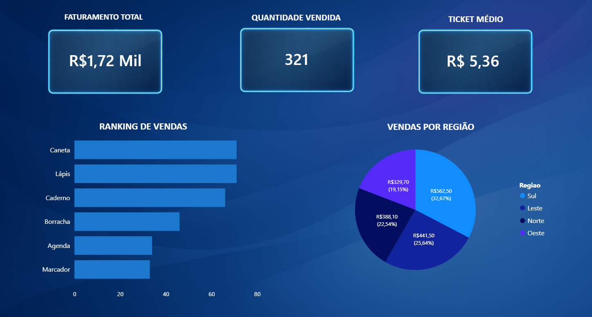

## Dashboard de Vendas - Power BI

## Dashboard

Este é um projeto simples de análise de vendas desenvolvido para praticar Power BI e iniciar um portfólio na área de dados.

A ideia foi trabalhar com uma base de dados propositalmente bagunçada, fazer o tratamento no Power Query e depois montar um dashboard com alguns indicadores básicos de vendas.

## Objetivo

Praticar algumas etapas comuns em projetos de dados:

- limpeza de dados
- padronização de informações
- criação de métricas
- construção de visualizações

## Base de dados

A base contém informações de vendas como:

- Produto
- Quantidade
- Preço
- Data da venda
- Região

A planilha original possui alguns problemas de dados, como:

- valores nulos
- produtos escritos de formas diferentes
- regiões com letras maiúsculas e minúsculas misturadas
- formatos diferentes de data

## Tratamento de dados

O tratamento foi feito no Power Query, incluindo:

- padronização dos nomes dos produtos
- padronização das regiões
- ajuste de tipos de dados
- tratamento de valores nulos
- criação da coluna de valor total da venda

## Indicadores do Dashboard

O dashboard apresenta alguns KPIs principais:

- Faturamento total
- Quantidade vendida
- Ticket médio

## Visualizações

Algumas análises presentes no dashboard:

- Ranking de produtos mais vendidos
- Distribuição de vendas por região

## Arquivos do projeto

- vendas_baguncadas.xlsx → base original com inconsistências
- vendas_tratadas.xlsx → base após limpeza
- dashboard_vendas.pbix → dashboard desenvolvido no Power BI

## Observação

Projeto criado como prática para desenvolvimento de habilidades em análise de dados e construção de portfólio.
